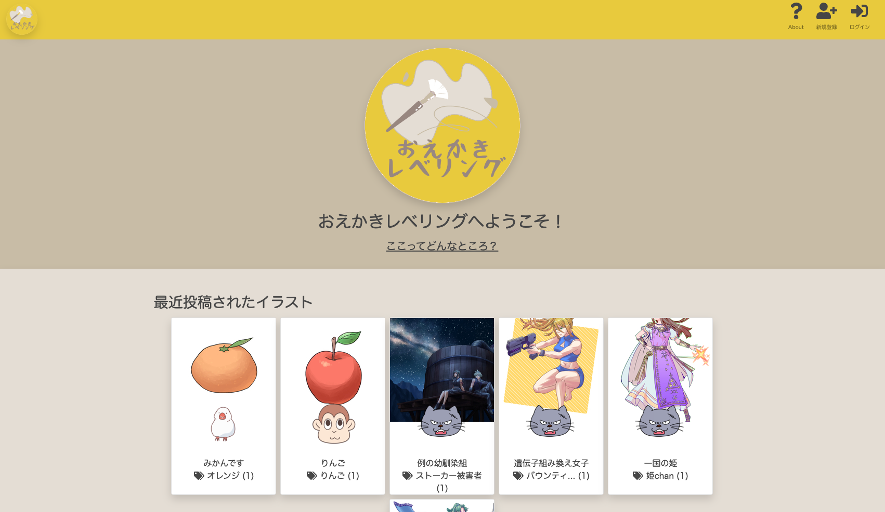

# おえかきレベリング

## URL
### https://oekaki-leveling.com/
ゲストログインボタンからゲストユーザーとしてログイン可能です。

## サイト概要
### サイトテーマ
このサイトはイラストの投稿サイトです。イラストが上手くなりたいユーザが、自分の絵を上達を実感できるように、ゲームにおけるレベリングのようなシステムを導入することでモチベーションの維持を計ります。
また、イラスト制作における各種工程（下書き・線画・配色・仕上げ）をそれぞれアップロードすることにより、各工程における細かい評価ができるようになっております。これにより、得意なところは評価されモチベーションアップにつながり、不得意なところは客観的に把握できるため、自身の練習のための参考となります。

### テーマを選んだ理由
自身がイラストが趣味で、なかなか練習が長続きしないことに悩んでおり、レベルアップのような実績解除システムがあったらいいなという思いから、このテーマを選びました。他のイラスト投稿サイトとの差別化要素は、ずばりレベリング機能です。また、完成品だけでなく各工程を投稿できるプラットフォームを用意しているところも差別化要素となります。
外出をしない休日の過ごし方がより一層浸透している世の中において、イラストという趣味は理に適っており、利用者の需要が見込まれます。また、昔に比べ、現在はタブレット端末さえあればデジタルイラストという趣味が始められることもあり、今後ますますユーザの増加が見込まれます。

### ターゲットユーザ
イラストが上手くなりたい、自身の成長を記録＆実感したいユーザをターゲットとしております。
イラストを始めたてのユーザはレベリング要素によって日々自身のスキルアップを実感することができ、イラストを既にある程度描けるユーザは自身のレベルを客観的に把握することができます。

### 主な利用シーン
自身が描いたイラストを評価してほしい時、自身の成長を実感したい時など

## 機能一覧
- ユーザアカウント機能
  - 新規登録・ログイン機能
  - ユーザ情報編集機能
  - ゲストログイン機能
  - ユーザのフォロー機能

- 投稿ページ
  - 一度に４枚までのイラストを投稿可能
  - 投稿に対するコメント機能
  - それぞれのイラストに対するいいね機能
  - 投稿のタグ付け機能、タグの絞り込み機能

- ユーザ、投稿、タグ検索機能

- 管理者ページ
  - ユーザの編集、退会、復帰機能
  - 投稿の編集、削除、復帰機能
  - コメントの削除、復帰機能
  - すべてのユーザ、投稿、タグの閲覧

- レベル機能（いいねの累計でレベルアップ）

## 設計書
- [こちら](https://drive.google.com/file/d/11i_MDkUhcNPyRs4PrNsxC3oig6hZ-f-2/view?usp=sharing)をご覧ください

## 開発環境
- OS：Linux(CentOS)
- 言語：HTML,CSS,JavaScript,Ruby,SQL
- フレームワーク：Ruby on Rails
- JSライブラリ：jQuery
- IDE：Cloud9